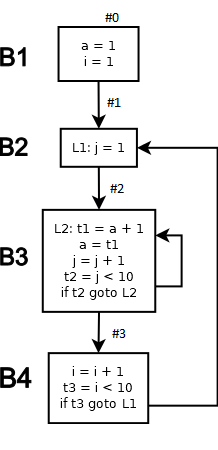

# Разбиение CFG (Control FlowGraph).

## Постановка задачи
Предоставить возможность получить граф потока управления по
набору базовых блоков.

## Команда — исполнитель
Null

## Зависимости
Зависит от:
- Разбиение на базовые блоки

Зависимые проекты:
- Все задачи анализа на уровне
- Все оптимизации на уровне

## Теория

Граф потока управления (CFG) – множество всех возможных путей
исполнения программы, представленное в виде графa.
В CFG каждый узел графа соответствует базовому
блоку.

В CFG устанавливаются связи между подряд
идущими базовыми блоками, кроме случая, когда базовый блок
завершается инструкцией перехода, а также между блоками в которых
есть безусловный переход и блоками, куда этот переход ведет.

Пример вида CFG:


## Реализация

Был реализован класс ControlFlowGraph , который
строиться по списку базовых блоков.

Класс является наследником BidirectionalGraph. 
Построение графа осуществляется при создании объекта класса, 
а с помощью метода Rebuild(tac) можно перестроить уже существующий граф.

Разбиваем трех-адресный код на базовые блоки и добавляем их все во множество вершин графа.
Для заполнения множество рёбер, запускаем цикл по всем блокам (вершинам). Внутри цикла у текущего блока смотрим на последний узел трех-адресного кода. Если он содержит оператор goto, находим блок с заданной меткой и добавляем ребро, связывающее их. Если оператор являлся чистым goto, а не if-goto, переходим к следующей итерации. Иначе в конце связываем текущий блок со следующим.

#### Дополнительные свойства

1. EntryBlock — входной блок, т.е. вершина, через которую управление входит в граф;
2. ExitBlock — выходной блок, т.е. вершина, которая завершает все пути в графе;
3. SourceCode — исходный трехадресный код, по которому был составлен граф.

## Тесты

#### INPUT:
```
a = 1;
for (i = 1 to 10)
	for (j = 1 to 10)
		a = a + 1;
```

#### OUTPUT:

```
VERTICES
#0:
a = 1  
i = 1  

#1:
L1: j = 1  

#2:
L2: t1 = a + 1
a = t1  
j = j + 1
t2 = j < 10
if t2 goto L2

#3:
i = i + 1
t3 = i < 10
if t3 goto L1

EDGES
0 -> [ 1 ]
1 -> [ 2 ]
2 -> [ 3 2 ]
3 -> [ 1 ]
```



## Вывод
Используя метод, описанные выше, мы смогли выполнить разбиение графa потока управления. 
