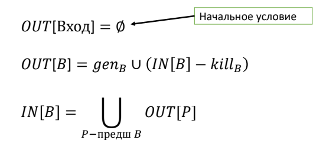

# Хранение IN-OUT

## Постановка задачи
Реализовать структуру для хранения множеств IN-OUT для всех базовых блоков программы

## Команда — исполнитель
AW

## Зависимости
Зависит от:
Хранение IN/OUT не зависит от других задач, заполнение IN/OUT зависит от:

- Разбиение на базовые блоки (Enterprise)
- Заполнение множеств GenB и KillB (Kt, Enterprise)

От данной задачи зависят:

- Все дальнейшие задачи и оптимизации, связанные с анализом потока данных;
- все реализации итеративных алгоритмов.

## Теория



***Оператор сбора*** &mdash; операция над множествами. Для данной задачи оператором сбора является объединение.

## Реализация
Хранение множеств IN и OUT происходит следующим образом:

```csharp
public class InOutContainer<T>
{
    public Dictionary<ThreeAddressCode, HashSet<T>> In = new Dictionary<ThreeAddressCode, HashSet<T>>();

    public Dictionary<ThreeAddressCode, HashSet<T>> Out = new Dictionary<ThreeAddressCode, HashSet<T>>();
    ...
}
```

В качестве дополнения, нами был реализованы методы для нахождения и хранения In-Out по всем базовым блокам с помощью множеств genB и killB в виде класса без дженериков:

```csharp
public Dictionary<OneBasicBlock, HashSet<TacNode>> In = new Dictionary<OneBasicBlock, HashSet<TacNode>>();
public Dictionary<OneBasicBlock, HashSet<TacNode>> Out = new Dictionary<OneBasicBlock, HashSet<TacNode>>();

/// <summary>
/// Построение множеств In и Out на основе gen и kill для каждого базового блока
/// </summary>
/// <param name="bBlocks"> Все базовые блоки </param>
/// <param name="genKillContainers"> Все множества gen и kill по всем базовым блокам </param>
public InOutContainer(BasicBlocks bBlocks,
    Dictionary<OneBasicBlock, IExpressionSetsContainer> genKillContainers)
{
    for (var i = 0; i < bBlocks.BasicBlockItems.Count; ++i)
    {
        var curBlock = bBlocks.BasicBlockItems[i];

        if (i == 0)
        {
            In[curBlock] = new HashSet<TacNode>();
        }
        else
        {
            var prevBlock = bBlocks.BasicBlockItems[i - 1];
            FillInForBasicBlock(curBlock, prevBlock);
        }

        FillOutForBasicBlock(curBlock, genKillContainers);
    }
}

/// <summary>
/// Заполняем множество In для текущего базового блока
/// Т.к. каждый последующий In - это объединение Out всех предыдущих блоков,
/// то достаточно знать только In и Out предыдущего блока, чтобы получить 
/// значение In текущего блока
/// </summary>
/// <param name="curBlock"> Рассматриваемы базовый блок </param>
/// <param name="prevBlock"> Предыдущий базовый блок </param>
public void FillInForBasicBlock(OneBasicBlock curBlock, OneBasicBlock prevBlock)
{
    In[curBlock] = new HashSet<TacNode>();
    In[curBlock].UnionWith(In[prevBlock]);
    In[curBlock].UnionWith(Out[prevBlock]);
}

/// <summary>
/// Заполняем множество OUT для текущего базового блока
/// </summary>
/// <param name="curBlock"> Рассматриваемы базовый блок </param>
/// <param name="genKillContainers"> Информация о gen и kill </param>
public void FillOutForBasicBlock(OneBasicBlock curBlock,
    Dictionary<OneBasicBlock, IExpressionSetsContainer> genKillContainers)
{
    if (genKillContainers.ContainsKey(curBlock))
    {
        Out[curBlock] = new HashSet<TacNode>(genKillContainers[curBlock].GetFirstSet()
            .Union(In[curBlock]
                .Except(genKillContainers[curBlock].GetSecondSet())));
    }
    else
    {
        Out[curBlock] = new HashSet<TacNode>(In[curBlock]);
    }
}
```

## Тесты
Тест для итеративного алгоритма для достигающих определений
### Input
#### Трехадресный код
```
a = 42
c = 100
t1 = a + 1
tmp = t1
t2 = 1 + a
t3 = t2 > 50
if t3 goto L1
goto L2
L1: t4 = 100 * c
b = t4
L2: i = 0
L3: tmp = a
a = 10
i = i + 1
t5 = i < 100
if t5 goto L3
```
#### Вершины CFG (базовые блоки)
```
#0:
a = 42
c = 100
t1 = a + 1
tmp = t1
t2 = 1 + a
t3 = t2 > 50
if t3 goto L1

#1:
goto L2

#2:
L1: t4 = 100 * c
b = t4

#3:
L2: i = 0

#4:
L3: tmp = a
a = 10
i = i + 1
t5 = i < 100
if t5 goto L3
```

### Output
#### Значения множеств IN/OUT (достигающие определения)
```
--- IN 0 :
null
--- OUT 0:
0)a = 42
1)c = 100
2)t1 = a + 1
3)tmp = t1
4)t2 = 1 + a
5)t3 = t2 > 50

--- IN 1 :
0)a = 42
1)c = 100
2)t1 = a + 1
3)tmp = t1
4)t2 = 1 + a
5)t3 = t2 > 50

--- OUT 1:
0)a = 42
1)c = 100
2)t1 = a + 1
3)tmp = t1
4)t2 = 1 + a
5)t3 = t2 > 50

--- IN 2 :
0)a = 42
1)c = 100
2)t1 = a + 1
3)tmp = t1
4)t2 = 1 + a
5)t3 = t2 > 50

--- OUT 2:
0)L1: t4 = 100 * c
1)b = t4
2)a = 42
3)c = 100
4)t1 = a + 1
5)tmp = t1
6)t2 = 1 + a
7)t3 = t2 > 50

--- IN 3 :
0)a = 42
1)c = 100
2)t1 = a + 1
3)tmp = t1
4)t2 = 1 + a
5)t3 = t2 > 50
6)L1: t4 = 100 * c
7)b = t4

--- OUT 3:
0)L2: i = 0
1)a = 42
2)c = 100
3)t1 = a + 1
4)tmp = t1
5)t2 = 1 + a
6)t3 = t2 > 50
7)L1: t4 = 100 * c
8)b = t4

--- IN 4 :
0)L2: i = 0
1)a = 42
2)c = 100
3)t1 = a + 1
4)tmp = t1
5)t2 = 1 + a
6)t3 = t2 > 50
7)L1: t4 = 100 * c
8)b = t4
9)L3: tmp = a
10)a = 10
11)i = i + 1
12)t5 = i < 100

--- OUT 4:
0)L3: tmp = a
1)a = 10
2)i = i + 1
3)t5 = i < 100
4)c = 100
5)t1 = a + 1
6)t2 = 1 + a
7)t3 = t2 > 50
8)L1: t4 = 100 * c
9)b = t4
```
## Вывод
Используя метод, описанные выше, мы смогли построить множество In-Out для всех базовых блоков. 
