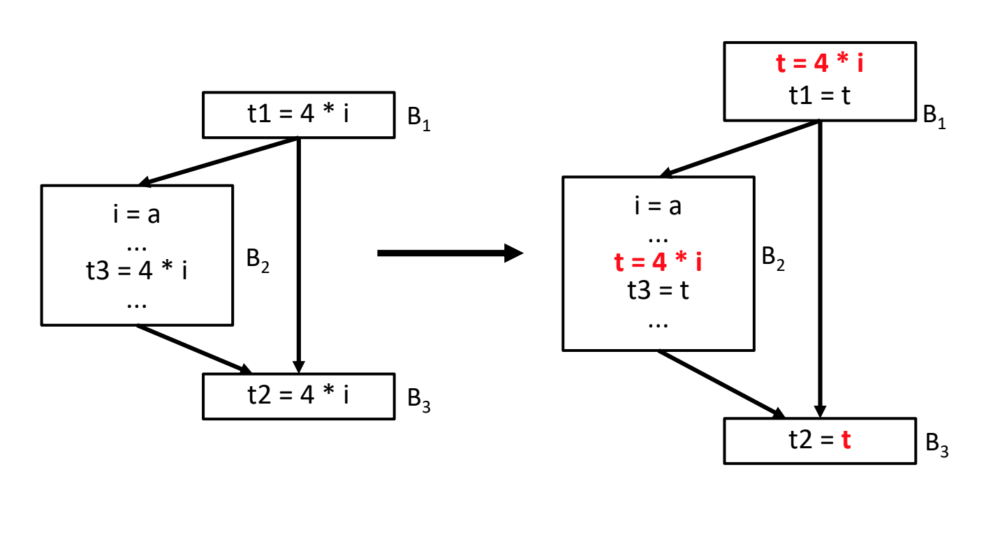

# Провести оптимизации на основе анализа доступных выражений.

## Постановка задачи
Реализовать оптимизации на основе анализа доступных выражений.
## Команда — исполнитель
M&M

## Зависимости
Зависит от  
- Базовых блоков  
- Трехадресного кода  
- Графа потока управления


## Теория
&mdash;

**Определение.** x+y доступно в точке p если любой путь от входа к p
вычисляет x+y и после последнего вычисления до достижения p нет
присваиваний x и y.

Оптимизации на основе доступных выражений:


## Реализация

Для решения поставленной задачи был реализован  AvailableExprOptimization:

```csharp
...
// проводим оптимизацию
for (int blockInd = 0; blockInd < bb.BasicBlockItems.Count(); blockInd++)
	{
	var block = bb.BasicBlockItems[blockInd];
	var codeLine = block.TACodeLines.First;
	foreach (var _expr in varsExprChange.Keys.ToArray())
		varsExprChange[_expr] = !IN_EXPR[block].Contains(_expr);
	while (codeLine != null)
	{
		var node = codeLine.Value;
		if (node is TacAssignmentNode assign)
		{
			string assignId = assign.LeftPartIdentifier;
			TacExpr expr = new TacExpr(assign);
			// если выражений больше 1 делаем оптимизацию
			if (tacExprCount.Keys.Contains(expr) && tacExprCount[expr] > 1)
			{
				isUsed = true;
				if (!varsExprChange.Keys.Contains(expr))
					varsExprChange.Add(expr, !IN_EXPR[block].Contains(expr));
			// если это первая замена общего выражения
			if (!idsForExprDic.Keys.Contains(expr))
			{
			// создаём переменную для общего выражения
				string idName = TmpNameManager.Instance.GenerateTmpVariableName();
				idsForExprDic.Add(expr, idName);
				block.TACodeLines.AddBefore(block.TACodeLines.Find(node), expr.CreateAssignNode(idName));
				AssignRightPartVarReplace(assign, idName);
				varsExprChange[expr] = false;
			} else
			{
				string idName = idsForExprDic[expr];
				// если это не замена общего выражения
				if (assignId != idName)
					AssignRightPartVarReplace(assign, idName);
				// если выражение недоступно на входе
				if (varsExprChange[expr])
					{
						block.TACodeLines.AddBefore(block.TACodeLines.Find(node), expr.CreateAssignNode(idName));
						varsExprChange[expr] = false;
					}
				}
			}
			// для всех оптимизируемых выражений
			foreach (var _expr in varsExprChange.Keys.ToArray())
			{
			// если выражение недоступно на выходе и присваивание его изменяет
				if (_expr.FirstOperand == assignId || _expr.SecondOperand == assignId)
				{
					varsExprChange[_expr] = true;
				}
			}
		}
		codeLine = codeLine.Next;
	}
}
...
```

## Тесты
```csharp
[TestMethod]
public void Optimize_RightOptimized1()
{
var tacContainer = new ThreeAddressCode();
            Utils.AddAssignmentNode(tacContainer, null, "t1", "4", "*", "i");
            Utils.AddAssignmentNode(tacContainer, null, "a1", "t1");
            Utils.AddAssignmentNode(tacContainer, null, "t2", "b");
            Utils.AddIfGotoNode(tacContainer, null, "L1", "t2");
            Utils.AddGotoNode(tacContainer, null, "L2");
            Utils.AddAssignmentNode(tacContainer, "L1", "t3", "4", "*", "i");
            Utils.AddAssignmentNode(tacContainer, null, "a3", "t3");
            Utils.AddAssignmentNode(tacContainer, "L2", "t4", "4", "*", "i");
            Utils.AddAssignmentNode(tacContainer, null, "a2", "t4");

            var expectedResult = new ThreeAddressCode();
            Utils.AddAssignmentNode(expectedResult, null, "t2", "4", "*", "i");
            Utils.AddAssignmentNode(expectedResult, null, "t1", "t2");
            Utils.AddAssignmentNode(expectedResult, null, "a1", "t1");
            Utils.AddAssignmentNode(expectedResult, null, "t2", "b");
            Utils.AddIfGotoNode(expectedResult, null, "L1", "t2");
            Utils.AddGotoNode(expectedResult, null, "L2");
            Utils.AddAssignmentNode(expectedResult, "L1", "t3", "t2");
            Utils.AddAssignmentNode(expectedResult, null, "a3", "t3");
            Utils.AddAssignmentNode(expectedResult, "L2", "t4", "t2");
            Utils.AddAssignmentNode(expectedResult, null, "a2", "t4");

            var cfg = new ControlFlowGraph(tacContainer);
            var expectedResultcfg = new ControlFlowGraph(expectedResult);
            E_GenKillVisitor availExprVisitor = new E_GenKillVisitor();
            var availExprContainers = availExprVisitor.GenerateAvailableExpressionForBlocks(cfg.SourceBasicBlocks);

            var availableExpressionsITA = new AvailableExpressionsITA(cfg, availExprContainers);

            var availableExprOptimization = new AvailableExprOptimization();
            bool isOptimized = availableExprOptimization.Optimize(availableExpressionsITA);
            var basicBlockItems = cfg.SourceBasicBlocks.BasicBlockItems;
            var codeText = cfg.SourceBasicBlocks.BasicBlockItems
                .Select(bl => bl.ToString()).Aggregate((b1, b2) => b1 + b2);

            Assert.IsTrue(isOptimized);
            Assert.AreEqual(cfg.ToString(), expectedResultcfg.ToString());
}
```
## Вывод
Используя методы, описанные выше, мы получили оптимизации на основе анализа доступных выражений
